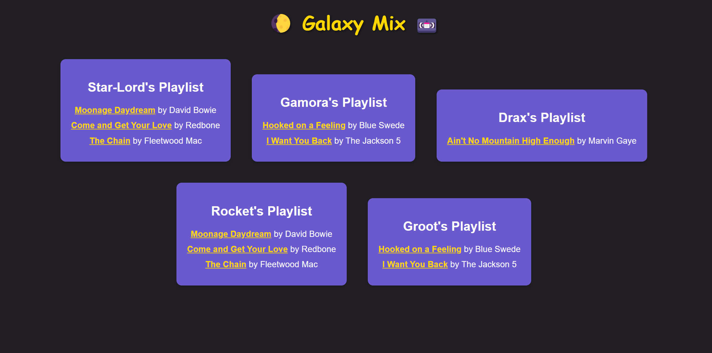

# [JSL05] Submission: Galaxy Playlist Generator

## Overview

In this challenge, I combined my knowledge of JavaScript arrays and the `map()` function to create a personalized "Awesome Mix" playlist for each of the Guardians of the Galaxy. The songs are filtered and organized based on each Guardian's musical preference, displaying a playlist tailored just for them.

## Reflections & Code choice:

1. **Expand the Songs Array**: I Added songs to the `songs` array, each with `title`, `artist`, and `genre`.
2. **Assign Preferences**: Successfuly completed the `guardians` object by assigning each Guardian their preferred music genre.
3. **Generate Playlists**: The `generatePlaylist` function uses the `map()` function to create a personalized playlist for each Guardian and filters the songs array to include only those songs whose genre matches the preferredGenre of the current guardian.
4. **Display Playlists**: Dynamically created and appended elements to the `#playlists` div to display each Guardian's playlist which includes the Guardian's name and their list of songs.

### Areas for Improvement
My understanding of arrays and objects is fairly sufficient to organize and manipulate data within a program but could really use more practice with using various built-in methods for manipulation  such as `push()`, `pop()`, `shift()`, `unshift()`, `splice()`, etc. for adding, removing, and modifying elements. The LMS notes seemed understandable but the application of `map()` and `filter()` to my code was a challenge for me.

Practice challenges on Scrimba: https://scrimba.com/playlist/pXXzN5GT6

